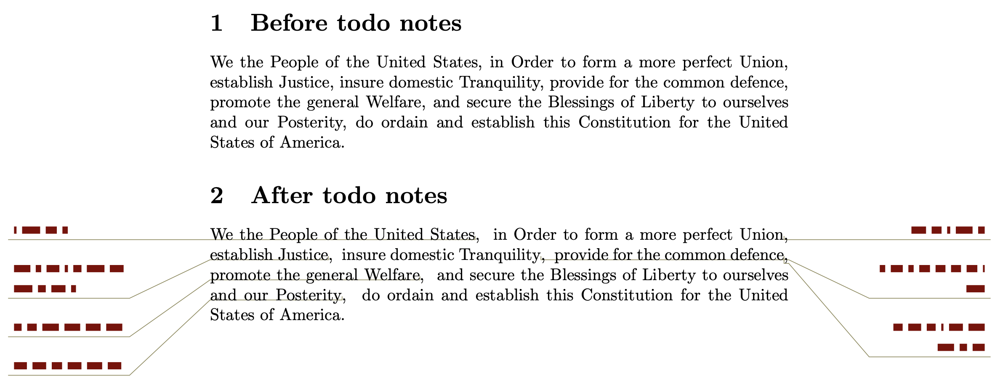

# snaptodo

a LaTeX ToDo PaCKaGe.

## Before vs After

## Documentation

Please check out the pdf documentation
[snaptodo.pdf](snaptodo.pdf).

## Installation

Copy and paste
[snaptodo.sty](snaptodo.sty)
to your working directory.

## Minimal Working Example

Try to compile
[minimal_testing.tex](minimal_testing.tex).

The result should be
[minimal_testing.pdf](minimal_testing.pdf).

## Dynamic Demo

Source code in [circle_testing.tex](circle_testing.tex).
